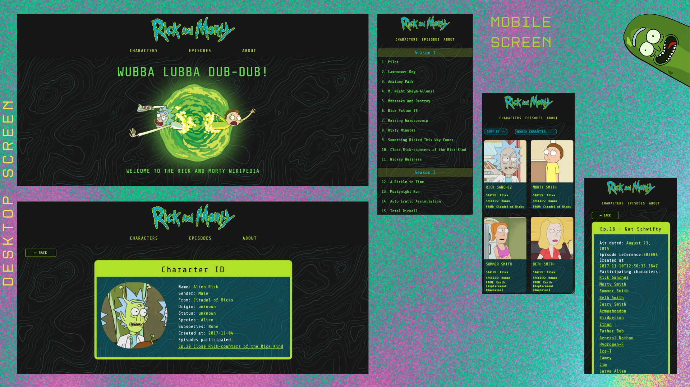

<div align="center">
  
   
</div>

The Rick and Morty Wikipedia is a responsive application where the user can get information from all the characters and episodes in this Adult Swim sitcom. 🛸

This project was built using an open RESTful API - [The Rick and Morty API](https://rickandmortyapi.com/).

## 👀 Try the demo!

https://rick-and-morty-wiki-cstrecht.vercel.app/

<div align="center">  
    
   
</div>

## 🔨 Built with:

- [React](https://reactjs.org/)
- [React Router v6](https://reactrouter.com/en/main)
- [react-paginate](https://github.com/AdeleD/react-paginate)
- [Tailwind CSS](https://tailwindcss.com/)
- Deployed with [Vercel](https://vercel.com/dashboard)

## 🚀 Getting Started

```bash
  # Clone the repository:
  $ https://github.com/cstrecht/rick-and-morty-wiki.git
  # Enter directory:
  $ cd rick-and-morty-wiki
  # Install dependencies:
  $ npm install
  # Start the server:
  $ npm start
```
